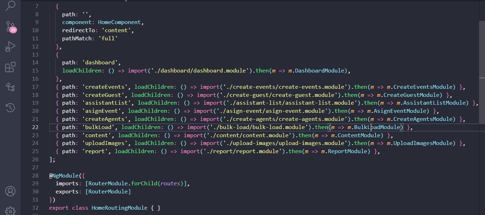
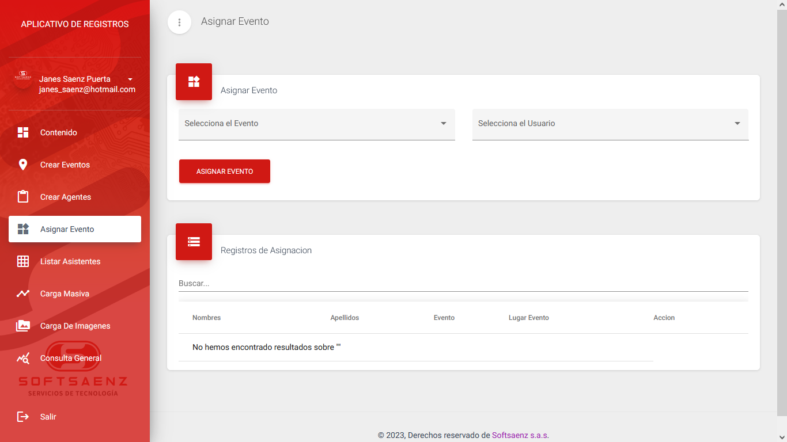
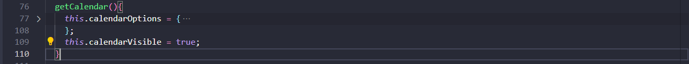
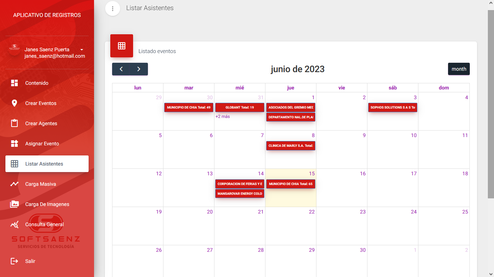
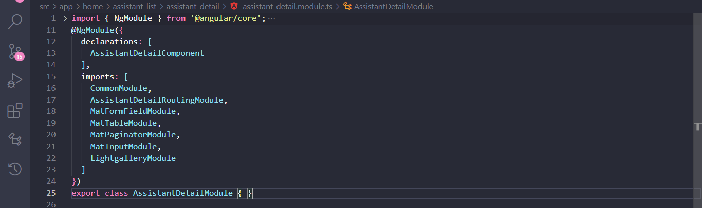
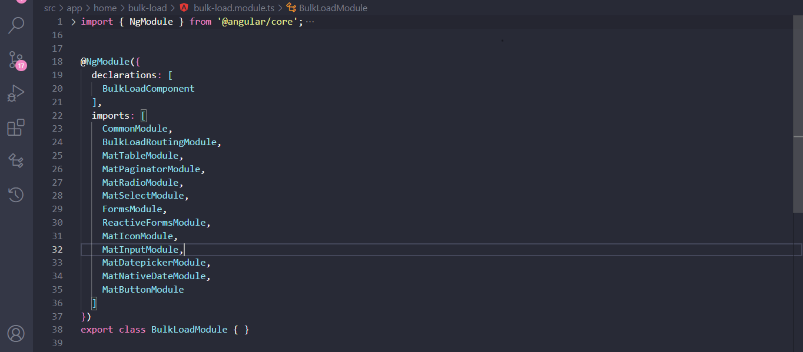
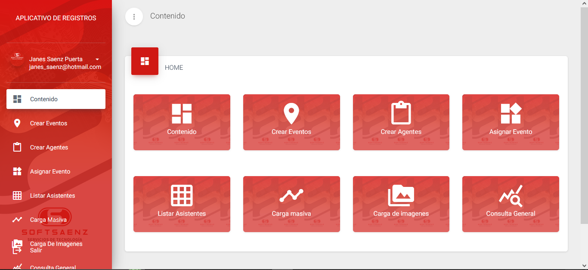

## Scan App (Softsaenz)

Escan App es un software diseñado por Softsaenz encargado de la recopilacion almacenamiento y registro de datos en su mejor funcionalidad, para eventos. 


### Instalacion
Es importante tener en cuenta los siguientes requisitos previos para la correcta intalacion del sofware de manera local. 

- Este proyecto esta implementado bajo la version 13.3.0 de angular. 
- Debido a cuestiones de compatibilida lo recomendable seria trabajar con la version numero 16.10.0 de Node.

Una vez conocido los requerimientos basicos, procedemos con la intalacion .

1. clona el proyecto desde su repositorio oficial: *introduzca el repositorio* usando el comando git clone
2. una vez descargado el proyecto dirijase hasta el directorio en donde se encuentra alojado el proyecto
3. posteriormente proceda a instalar las dependencias del mismo usando el comando (npm intall)
4. ya con las dependencias descargadas ejecute el proyecto con el comando (ng serve --o)

De haber completado los anteriores pasos el aplicativo estara corriendo en el puerto localhost:4200 de este estar ocupado correra en otro puerto distinto. Y se encontrara con la siguiente interfaz


## Estructura del proyecto
ScanApp al ser hecho con angular posee todo lo nesasrio que este framewok ofrece en este caso encontramos lo siguiente:

El directorio 'src' contiene alojado todo el codigo de nuestro aplicativo.
Dentro de src se encuentra la carpeta app que es la que contiene los componentes servicios y modulos necesarios para la aplicacion. en el caso del los componentes cada uno de estos contien su propio directorio con los archivos relacionados, encontraremos un archivo TypeScript, un Html, el archivo encargado de dar estilos css y por ultimo el archivo de pruebas (spect.ts).
Los servicios se encuentran dentro del directorio 'service'.
EL directorio assets almacena los recursos esteticos del aplicativo, los cuales son los estilos, las fuentes, las imagenes. entre otros

## Componentes ###

- ### Home: 
    Esta carpeta contiene todas las funcionalidades del aplicativo divididos en disferentes componentes.adicionalmente contiene las rutas y carga de componentes respecto a las mismas; como se muestra a continuacion.
    ### **home-routing.module.ts**
    este código establece las rutas de navegación para diferentes componentes y módulos dentro del módulo HomeModule. Cada ruta especifica la ruta URL y el módulo que se carga cuando se accede a esa ruta. El uso de la carga diferida (lazy loading) permite cargar los módulos de forma asíncrona, mejorando así el rendimiento de la aplicación.
    

    ### **home.module.ts**
    este código establece las rutas de navegación para diferentes componentes y módulos dentro del módulo HomeModule. Cada ruta especifica la ruta URL y el módulo que se carga cuando se accede a esa ruta. El uso de la carga diferida (lazy loading) permite cargar los módulos de forma asíncrona, mejorando así el rendimiento de la aplicación.

    ```ts
    import { NgModule } from '@angular/core';
    import { CommonModule } from '@angular/common';
    import { HomeRoutingModule } from './home-routing.module';
    import { HomeComponent } from './home.component';
    @NgModule({
    declarations: [
        HomeComponent
    ],
    imports: [
        CommonModule,
        HomeRoutingModule
    ]
    })
    export class HomeModule { }
    ```
     
     a continuacion la descripcion y documentacion de los componentes que invoca Home.


    1. ## asing event 
        
        este compononte sera el encargado de asignar un evento que previamente fue registrado o que simplemente ya existe. encontrara un archivo llamado asign-event.component.ts que tendra lo siguiente:

        ## **asign-event.component.ts**

        __variables__
        ```typescript
            displayedColumns: string[] = ['names', 'lastnames', 'event', 'eventPlace', 'action'];
            public eventList: userDataList[] = []
            public customerDetail: any = [];
            public eventsItems: any = [];
            public usersItems: any = []
            public selectItems: any;
            public usersData: any;
            public dataSource: MatTableDataSource<userDataList>
            public form: FormGroup
        ```
        un metodo constructor, que inyectara nuestros servicios mediante variables privadas
        ```typescript
        constructor(
                private localStorage: LocalstoreService,
                private myFormBuilder: FormBuilder,
                private _https: AuthService,
                private alert: AlertService,
            ) {
                this.customerDetail = this.localStorage.getItem(Menssage.customerDetail)
                this.usersData = this.localStorage.getSuccessLogin();
                this.getEvents(this.usersData.user.idClientsProjects);
                this.getUsers(this.usersData.user.idClientsProjects)
            }
        ```
        Ahora tenemos un ngOninit donde llamaremos a nuestro metodo this.initial()
        ```typescript
            ngOnInit(): void {
            this.initial()
            }
        ```
        __Initial()__ se encargara de asignar o mejor dicho de inicializar nuestro formulario (form) haciendo uso de FormGroup proveniente de Angular Reactive Forms. this.myFormBuilder.group creara un grupo de controles del formulario, especificamente 'events' y 'users' Ambos poseen un valor inicial de Menssage.empty, luego tenemos los campos de validaciones en estos 2 casos son Validators.nullValidator que indica que no se aplican validaciones adicionales al valor de control
        ```typescript 
        initial() {
            this.form = this.myFormBuilder.group({
            events: [Menssage.empty, Validators.compose([Validators.nullValidator])],
            users: [Menssage.empty, Validators.compose([Validators.nullValidator])]
            })
            this.loadData()
        }
        ```

        __getEvents()__ este metodo serra el encargado de traer los eventos que tenga el aplicativo, mediante .https accedera al servicio (AuthService) especificamente a su metodo getEvent(), el cual hara un solicitud API para obtener la informacion, maneja respuestas exitosas y tambie errores.
        getEvents recibe como parametro un 'item' de tipo number, una vez recibido este parametro
        this.alert.loading() es el encagado de llamar al metodo loading para mostrar una informacion visula de qiue se esta cargando la informacion. this._https.getEvent(item) estara haciendo la solicitud a la API, this._https.getEvent(item).then((resulta: any) => {}) el resultado de la peticion hevha anteriormente la capturamos en el parametro (resulta). this.eventsItems = resulta asiganra el valor de resulta a la bvariable eventsItems. alert.messagefin() indica que la carga de informacion ha terminado.
        .catch((err: any) => {}) Marcara error en caso de que nuestra solicitud sea rechazada e imprimira en consola el error (console.log(err))
        ```typescript
        getEvents(item: number) {
            this.alert.loading();
            this._https.getEvent(item).then((resulta: any) => {
                console.log(resulta);
                this.eventsItems = resulta
                this.alert.messagefin();
            }).catch((err: any) => {
                console.log(err)
                this.alert.error(Menssage.error, Menssage.server);
            });
        }
        ```
        __loadData()__: crea una nueva instancia de (MatTableDataSource) y lo asigna a la propiedad (dataSource), cargando asi los datos almacenados en (eventList). 
        ```typescript
        loadData() {
            this.dataSource = new MatTableDataSource(this.eventList)
        }
        ```

        __applyFilter(event: Event)__: este metodo tiene como funcion aplicar un filtro en la tabla de datos recibe como parametro un event de tipo Event;
        const filterValue = (event.target as HTMLInputElement).value; obtiene el valor de filtro ingresado por el usuario; (event.target as HTMLInputElement).value; permite acceder al valor de entrada en el HTML (input).
        this.dataSource.filter = filterValue.trim().toLowerCase(); aplica el filtro al origen de datos (dataSource). la propiedad filter se usa para aplicar el filtro en la fuente de datos. Este es un metodo originalmente de angular Material, puede aondar mas en su documentacion oficial en [Angular Material](https://material.angular.io/components/table/examples)

        ```typescript
        applyFilter(event: Event) {
            const filterValue = (event.target as HTMLInputElement).value;
            this.dataSource.filter = filterValue.trim().toLowerCase();
        }
        ```
        **saveData()** este metodo sera el encargado de guadar la informacion recibida en el formulario, en este caso lo imprime en consola.
        ```typescript
        saveData(){
            console.log(this.form);
        }
        ```


        ## **asign-event-routing.module.ts**
        
        Este bloque de codigo define un modulo de enrutamiento en Angular llamado (asign-event-routing.module.ts) configurara una ruta para acceder al modulo. 
        ```typescript
        import { NgModule } from '@angular/core';
        import { RouterModule, Routes } from '@angular/router';
        import { AsignEventComponent } from './asign-event.component';

        const routes: Routes = [{ path: '', component: AsignEventComponent }]; //componente asociado a la ruta

        @NgModule({
        imports: [RouterModule.forChild(routes)],
        exports: [RouterModule]
        })
        export class AsignEventRoutingModule { }
        ```

        ## **asing-event.module.ts**
        
        Este modulo sera el encargado de las importanciones, asi como de configurar varios componentes y modulos necesarios para el funcionamiento del componente(asign-event), a continuacion las imnportaciones necesarias para el funcionamiento del componente: 
        ```ts 
        import { NgModule } from '@angular/core';
        import { CommonModule } from '@angular/common';

        import { AsignEventRoutingModule } from './asign-event-routing.module';
        import { AsignEventComponent } from './asign-event.component';
        import { MatTableModule } from '@angular/material/table';
        import { MatPaginatorModule } from '@angular/material/paginator';
        import { MatRadioModule } from '@angular/material/radio';
        import { MatSelectModule } from '@angular/material/select';
        import { FormsModule, ReactiveFormsModule } from '@angular/forms';
        import { MatIconModule } from '@angular/material/icon';
        import { MatInputModule } from '@angular/material/input';
        import { MatDatepickerModule } from '@angular/material/datepicker';
        import { MatNativeDateModule } from '@angular/material/core';
        import { MatButtonModule } from '@angular/material/button';

        ```
        Ahora bien 'declarations: [AsignEventComponent ]' nos indica que el componente esta disponible para ser usado en el modulo 
        ```ts
        @NgModule({
        declarations: [
            AsignEventComponent
        ],
        imports: [
            CommonModule,
            AsignEventRoutingModule,
            MatTableModule,
            MatPaginatorModule,
            MatRadioModule,
            MatSelectModule,
            FormsModule,
            ReactiveFormsModule,
            MatIconModule,
            MatInputModule,
            MatDatepickerModule,
            MatNativeDateModule,
            MatButtonModule
        ]
        })
        ```
        ## asing event
        


    2. ## assistant-list

        Este componente sera el encargado de traer el listado de eventos realizados en un calendario, este componente cuenta con un componente hijo llamado 'assistant-detail' que contendra el detalle de cada evento que se encuentre registrado en el calenadrio. a continuacion el componente padre (assistant-list).

        ## **assistant-list.component.ts**
        este es su metodo constructor; 
        ```ts
        constructor(
            private localStore: LocalstoreService, //inyecta el servicio de local storange
            private _https: AuthService, //inyecta el servicio de AuthService
            private router: Router, //clase proveniente de angular para la navegacion entre las rutas
            private alert: AlertService) { 
            this.usersData = this.localStore.getSuccessLogin(); /*se llama al metodo getSuccessLogin() 
            del servicio localStore para obtener los datos detos de inicio de sesion exitos*/
            this.customerDetail = this.localStore.getItem(Menssage.customerDetail)
            if (this.usersData) {
            this.getMenu(this.usersData.user.idClientsProjects, "");
            } /*en primera se hace una validacion (condicion) donde se verifica que userData exista de 
            ser asi se convoca al metodo getMenu() que explicaremos posteriormente, este metodo recibe 
            2 argumentos uno de tipo number y otro de tipo string que esta como una cadena de texto vacia*/
        }
        ```
        **ngOnInit():** 
        ```ts
        ngOnInit(): void {
            forwardRef(() => Calendar);
            
        }
        ```
        **__getMenu(item: number, search: string)__**: este metedo estara encargado de: 

        ```ts
        getMenu(item: number, search: string){
            //muestra un mensaje de carga en la interfaz de usuario
            this.alert.loading();
            //realiza una solicitud pra obtener el resultado de la busqeda
            this._https.gettotal(item, search).then((resulta: any)=>{
                    //oculta el mensaje de carga
                    this.alert.messagefin();
                    //valida que el resultado no este vacio o sea igual a cero(Verifica la obtencion de resultados)
                    if (resulta.length != 0) {
                        //iteracion de en cada elemento obtenido
                        resulta.forEach(element => {
                            //agrega a la lista de eventos
                            this.eventList.push(
                                {
                                id: element.id,
                                title: element.companyNameEvent+' Total: '+ element.total,
                                start: element.fecha,
                                end: element.fecha,
                                className: 'event-rose'
                                },
                            );
                    });
                    //valida que se hayan agrgaron los eventos
                    if (this.eventList.length != 0) {
                        //de cumplirse la condicion anterior llamara al metodo getCalendar()
                        this.getCalendar(); 
                    }
                    
                    }
            //en caso de error mostrara un mensaje que indicara un fallo en la peticion
            }).catch((err: any)=>{
                console.log(err)
                this.alert.error(Menssage.error, Menssage.server);
            });
        }
        ```
        **__getCalendar()__**: este metodo es parte de la configuracion y manejo del calendario haciendo uso de la biblioteca FullCalendar. si desea aondar mas acerca de esta libreria puede dirigirse hasta la documentacion de esta libreria para saber como usarla [FullCalendarDocs](https://fullcalendar.io/docs)
        
        

        __handleDateClick(arg: DateClickArg)__:  Este método se invoca cuando se hace clic en una fecha en el calendario. Toma un argumento arg que contiene información sobre el evento de clic en la fecha. En el cuerpo del método, se muestra un mensaje en la consola para indicar que se ha producido un evento de clic en la fecha, y luego se muestra el contenido del argumento arg en la consola.

        ```ts 
        handleDateClick(arg: DateClickArg) {
            console.log('dateclick');
            console.log(arg);
            console.log('dateclick');
        }
        ```
        __handleEventClick(arg: EventClickArg)__: Este método se invoca cuando se hace clic en un evento en el calendario. Toma un argumento arg que contiene información sobre el evento de clic en el evento. En el cuerpo del método, se imprime arg.event._def en la consola. Luego, se verifica si arg.event._def.publicId no está vacío. Si no está vacío, se realiza una serie de acciones.
        ```ts
        handleEventClick(arg: EventClickArg) {
            console.log(arg.event._def);
            if (arg.event._def.publicId != "") {
                let token = this.convertTextEncrypt(arg.event._def.publicId)
                this.router.navigate([RoutersLink.assistantDetail+token]);
            }
        }
        ```
        __handleEventDragStop(arg: EventDragStopArg)__: En el cuerpo del método, se muestra un mensaje en la consola para indicar que se ha detenido el arrastre del evento, y luego se muestra el contenido del argumento arg en la consola.
        ```ts
        handleEventDragStop(arg: EventDragStopArg) {
            console.log('DragStop');
            console.log(arg);
            console.log('DragStop');
        }
        ```
        ## **assistant-list-routing.module.ts**
        este código configura las rutas de la aplicación utilizando el módulo de enrutamiento de Angular. Define las rutas y las asocia a los componentes correspondientes. 

        ```ts
        import { NgModule } from '@angular/core';
        import { RouterModule, Routes } from '@angular/router';
        import { AssistantListComponent } from './assistant-list.component';
        //  define las rutas de la aplicación. La primera ruta muestra el componente AssistantListComponent cuando se accede a la URL base, y la segunda ruta carga de forma diferida el módulo AssistantDetailModule cuando se accede a una URL específica
        const routes: Routes = [{ path: '', component: AssistantListComponent }, 
        { path: 'assistantDetail/:token', loadChildren: () => import('./assistant-detail/assistant-detail.module').then(m => m.AssistantDetailModule) }];

        @NgModule({
        imports: [RouterModule.forChild(routes)],
        exports: [RouterModule]
        })
        export class AssistantListRoutingModule { }
        ```
        ## **assistant-list.module.ts**
        El módulo 'AssistantListModule' es responsable de importar y configurar los recursos necesarios para el componente 'AssistantListComponent'.
        Incluye las importaciones de otros módulos y la declaración del componente.
        

        ## assistant-list
        


        - ## **assistant-detail**
            interfaz: 
            ```ts
            export interface UserData {
            id: number,
            idRegister: number,
            name: string,
            company: string,
            nit: string,
            fechaEvent: string,
            nameUser: string,
            surname: string,
            service: string,
            subservice:string,
            document: string,
            email: string,
            telephone: string,
            fecha: string,
            }
            ```
            variables 
            ```ts
            public tableData1: TableData;
            public usersData: any;
            public galleryDataImage: any =[];
            public eventList: any = [];
            public calendarVisible = false;
            public eventsData: any = [];
            public customerDetail: any = [];
            ```
            ### **constructor**
             El constructor del componente 'AssistantDetailComponent' se utiliza para inyectar los servicios y otras dependencias necesarias, así como para realizar algunas tareas de inicialización.
            ```ts 
             constructor(
                private localStore: LocalstoreService, /*El servicio `LocalstoreService` utilizado para acceder al 
                almacenamiento local y obtener datos del asistente actualmente autenticado.*/
                private activatedRoute: ActivatedRoute, /*El servicio `ActivatedRoute` utilizado para obtener los 
                parámetros de la URL, como el token del asistente.*/
                private _https: AuthService, /* El servicio `AuthService` utilizado para realizar solicitudes HTTP 
                y obtener datos del servidor.*/
                private router: Router, /*Inyecta el servicio `Router` utilizado para navegar a otras rutas en 
                la aplicación.*/
                private alert: AlertService,
                private excel: ExcelService) /* El servicio `ExcelService` utilizado para exportar datos a un 
                archivo Excel.*/ { 
                this.usersData = this.localStore.getSuccessLogin();
                this.customerDetail = this.localStore.getItem(Menssage.customerDetail)
                //subcripcion a los parametros de la url
                this.activatedRoute.paramMap.subscribe((parametros: ParamMap) => {
                    let token = parametros.get("token");
                    console.log(token)
                    if (token != null) {
                    let tokenDecript = parseInt(this.convertTextDecrypt(token))
                    console.log(tokenDecript)
                    this.gettotaldatagallery(tokenDecript)
                    this.gettotaldata(tokenDecript)
                    } else {
                    this.customerDetail = [];
                    }
                })
                //para la tabla de datos
                this.dataSource = new MatTableDataSource(this.eventsData);
            }   
            ```
            ### **applyFilter(event: Event)**
            este metodo tiene como funcion aplicar un filtro en la tabla de datos recibe como parametro un event de tipo Event; const filterValue = (event.target as HTMLInputElement).value; obtiene el valor de filtro ingresado por el usuario; (event.target as HTMLInputElement).value; permite acceder al valor de entrada en el HTML (input). this.dataSource.filter = filterValue.trim().toLowerCase(); aplica el filtro al origen de datos (dataSource). la propiedad filter se usa para aplicar el filtro en la fuente de datos. Este es un metodo originalmente de angular Material, puede aondar mas en su documentacion oficial en [Angular Material](https://material.angular.io/components/table/examples)

            ```ts
            applyFilter(event: Event) {
                const filterValue = (event.target as HTMLInputElement).value;
                this.dataSource.filter = filterValue.trim().toLowerCase();
                //verifica que el paginador este disponible en la tabla
                if (this.dataSource.paginator) {
                this.dataSource.paginator.firstPage();
                }
            }
            ```
            ### **gettotaldatagallery(item: number)**
            ```ts
            gettotaldatagallery(item: number){
                //Muestra un mensaje de carga
                this.alert.loading();
                //realiza lasolicitud gracias al nuestro servicio AuthService mediante .https 
                this._https.gettotaldatagallery(item).then((resulta: any)=>{
                // alamacena los datos en la variable galleryDataImage
                this.galleryDataImage = resulta;
                //oculta el mensaje de carga
                this.alert.messagefin();
                //en caso de error en la solicitud mostrara un mensaje de error
                }).catch((err: any)=>{
                console.log(err)
                this.alert.error(Menssage.error, Menssage.server);
                });
            }
            ```

            ### **gettotaldata(item: number)**  
            Este metodo obtendra los datosmediante una solicitud a nuestro servicio AuthService y actualizara los datos de eventsData y dataSource.
            como parametro recibira un dato (item) de tipo number 

            ```ts
            gettotaldata(item: number){
                //muestra un mensaje de carga
                this.alert.loading();

                //realiza una solicitud al servicio correspondiente (AuthService)
                this._https.gettotaldata(item).then((resulta: any)=>{
                let count = 1;
                resulta.forEach(element => {
                    this.eventsData.push({
                        //construye un objeto y lo agrega a eventsData
                        id: count++,
                        idRegister:element.id,
                        name: element.nameEvent,
                        company: element.companyNameEvent,
                        nit: element.nitEvent,
                        fechaEvent: element.dateEvent,
                        nameUser: element.firstName,
                        surname: element.secondName,
                        service: element.secondSurname,
                        subservice:element.documentType,
                        document: element.DocumentNumber,
                        email: element.email,
                        telephone: element.telephone,
                        fecha: element.fecha,
                    },);
                });
                this.dataSource = new MatTableDataSource(this.eventsData);
                //asigna el paginador 
                this.dataSource.paginator = this.paginator;
                this.dataSource.sort = this.sort;

                //oculta el mensaje de carga
                this.alert.messagefin();

                //en caso de error mostrara un mensaje de error
                }).catch((err: any)=>{
                console.log(err)
                this.alert.error(Menssage.error, Menssage.server);
                });
            }
            ```

            ### **deleteList(item: number)**
            este metodo se encargara de eliminar el dato registrado en la tabla, recibira un parametro de tipo number llamado item.
            ```ts
            deleteList(item: number){
                //mensaje de carga 
                this.alert.loading();

                //solicitud al servicio para eliminar el registro
                this._https.gettotaldataDelete(item).then((resulta: any)=>{

                //muestra un mensaje de exito
                this.alert.success(Menssage.exito, Menssage.successDelete);
                this.gettotaldata(item);

                //en caso de error muestra un mensaje de error
                }).catch((err: any)=>{
                console.log(err)
                this.alert.error(Menssage.error, Menssage.server);
                });
            }
            ```
            ### **dowload()**
            este metodo nos permitira descargar los registros existentes en la tabla de datos mediante un archivo excel haciendo una vez mas un solicitud a al servicio AuthService 
            ```ts
            dowload(){
                //mensaje en consola
                console.log("entro");
                //validacion si los datos estan vacios
                if (this.eventsData.length != 0) {
                    
                //exporta los datos en un archivo excel
                this.excel.exportAsExcelFile(this.eventsData, Menssage.nameEvents);

                //de no haber datos arrojara un mensaje 
                }else{
                this.alert.error(Menssage.error, Menssage.nameEventsNull);
                }
            }
            ```
            ## **assistant-detail-routing.module.ts**

            El módulo AssistantDetailRoutingModule es responsable de configurar las rutas para el componente AssistantDetailComponent.
            ```ts
            import { NgModule } from '@angular/core';
            import { RouterModule, Routes } from '@angular/router';
            import { AssistantDetailComponent } from './assistant-detail.component';
            //Definicion de la rustas del modulo  AssistantDetail
            const routes: Routes = [{ path: '', component: AssistantDetailComponent }];

            @NgModule({
            imports: [RouterModule.forChild(routes)],
            exports: [RouterModule]
            })
            export class AssistantDetailRoutingModule { }
            ```
            ## **assistant-detail.module.ts**
            Dentro del módulo, se declara el componente AssistantDetailComponent y se importan los módulos necesarios para su funcionamiento. Estos módulos se agregan al arreglo imports, lo que permite que el componente y las dependencias asociadas sean utilizadas en otros módulos de la aplicación.
            
            ## assistant-detail
            
            
    3. ## bulk-load
        Este componente se encargara de la carga masiva de archivos, permitira la seleccion de eventos. 
        ## **bulk-load.component.ts**
        variables:
        ```ts
        displayedColumns: string[] = ['id', 'assesorName', 'companyName', 'nit', 'eventPlace', 'image']; //columnas
        public eventList: userDataList[]=[]
        public usersData: any;
        public selectItems: any;
        public customerDetail: any = [];
        public form: FormGroup;
        public eventsItems: any = [];
        public images: any = [];
        public file: File;
        public photoSelection: string | ArrayBuffer;
        public dataSource: MatTableDataSource<userDataList>
        ```
        su metodo contructor se encarga de inicializar las propiedades de la clase y obtener datos necesarios para su funcionamiento a través de los servicios inyectados.
        ```ts
        constructor(
            private localStorage: LocalstoreService, //llamdo el servicio de LocalstoreService
            private myFormBuilder: FormBuilder, //instancia de FormBuilder
            private _https: AuthService, //servicio de AuthService para hacer peticiones
            private alert: AlertService //muestra mensajes de alerta
        ) { 
            this.customerDetail = this.localStorage.getItem(Menssage.customerDetail);
            this.usersData = this.localStorage.getSuccessLogin();
            this.getEvents(this.usersData.user.idClientsProjects);

        }
        ```
        **initial()** este metodo sera el encargado de alamacenar el formulario de registros, en este caso de imagenes y tambien de la seleccion de eventos, estos datos seran requeridos obligatoriamente. 
        ```ts
        initial(){
            this.form = this.myFormBuilder.group({
            events:[Menssage.empty, Validators.compose([Validators.required])], //indica que los campos son requeridos
            images: [Menssage.empty, Validators.compose([Validators.required])]
            })
            this.loadData() //caragara los datos obtenidos a la tabla
        }
        ```

        **saveData()** en este caso se imprimiran los valores introducidos por el usuario en consola
        ```ts
        saveData(){
            console.log(this.form);
        }
        ```
        **resetForm()** este metodo sera el encargado de borrar los datos del usuario una vez ya haya llenado el formulario y desee ingresar un nuevo valor
        ```ts
        resetForm(){
            this.form.reset()
        }
        ```
        **getEvents(item: number)** este metodo serra el encargado de traer los eventos que tenga el aplicativo, mediante .https accedera al servicio (AuthService) especificamente a su metodo getEvent(), el cual hara un solicitud API para obtener la informacion, maneja respuestas exitosas y tambie errores.
        ```typescript
        getEvents(item: number) {
            this.alert.loading();
            //llama al metodo getEvent() proporcionado por AuthService mediante _https
            this._https.getEvent(item).then((resulta: any) => {
                console.log(resulta);
                //asigna el valor de la llamada al arreglo eventsItems
                this.eventsItems = resulta

                //muestra un mensaje usando el servicio de alert
                this.alert.messagefin();

                //en caso de error mostrara un mensaje de error
            }).catch((err: any) => {
                console.log(err)
                this.alert.error(Menssage.error, Menssage.server);
            });
        }
        ```

        **photoSelected(event: HTMLInputEvent)** este metodo nos dara la posibilidad de ver la imagen precargada al formulario
        ```ts
        photoSelected(event: HTMLInputEvent): void{
            //para saber si estan subiendo una foto de ser asi continue
            if(event.target.files && event.target.files[0]){
            this.file = <File> event.target.files[0];
            //Ahora previzualiza la imagen
            let reader = new FileReader();
            reader.onload = e => this.photoSelection = reader.result
            reader.readAsDataURL(this.file)
            }
        }
        ```
        **applyFilter(event: Event)** aplicara un filtro de datos para la tabla

        ```ts
        applyFilter(event: Event) {
            //Obtener el valor del filtro
            const filterValue = (event.target as HTMLInputElement).value;

            //aplica el filtro al dataSource
            this.dataSource.filter = filterValue.trim().toLowerCase();
        }
        ```
        **loadData()** la función loadData() inicializa el origen de datos de la tabla (dataSource) con los datos proporcionados en eventList, lo que permite mostrar los datos en la tabla de forma adecuada.

        ```ts
        loadData(){
            //crea una nueva intancia de MatTableDataSource y la asigana a dataSoruce
            this.dataSource = new MatTableDataSource(this.eventList)
        }
        ```
        ## **bulk-load-routing.module.ts**
        En este código, se importan los módulos necesarios desde @angular/core y @angular/router. A continuación, se define una constante routes que contiene una ruta vacía ('') con el componente BulkLoadComponent asociado a ella.
        Luego, se utiliza el decorador NgModule para definir el módulo de enrutamiento. En imports, se importa el módulo RouterModule y se configuran las rutas utilizando forChild(routes), donde routes es la constante definida anteriormente. En exports, se exporta RouterModule para que otros módulos puedan acceder a las rutas definidas en este módulo.

        ```ts
        import { NgModule } from '@angular/core';
        import { RouterModule, Routes } from '@angular/router';
        import { BulkLoadComponent } from './bulk-load.component';

        const routes: Routes = [{ path: '', component: BulkLoadComponent }];

        @NgModule({
        imports: [RouterModule.forChild(routes)],
        exports: [RouterModule]
        })
        export class BulkLoadRoutingModule { }
        ```
        ## **bulk-load.module.ts**
        En este código, se importan los módulos necesarios desde @angular/core y @angular/common. Luego, se importa el módulo de enrutamiento BulkLoadRoutingModule desde el archivo bulk-load-routing.module, estas importacion SON necesarias para que el aplicativo funcione
        
        ## bulk-load
        
    
    4. ## content
    Este componente tiene la funcion de mostar en pantalla el ccontenido inicial que el usuario ve una vez hay realizado el login exitosamente. 
    ## **content.components.ts**
    variables: 
    ```ts
    public menuItems: any[] = [];
    public menuItemsStore: any[];
    public usersData: any;
    public customerDetail: any = [];
    ```
    en su metodo constructor
    ```ts
    constructor(
    private localStore: LocalstoreService, //llama el servicio de LocalstoreService mediante inyeccion de dependencias
    private _https:AuthService, //llama el servicio de AuthService
    private router: Router,  //servicio de enrutamiento 
    private alert: AlertService)  // servicio de alertas o mensajes
    { 
      this.usersData = this.localStore.getSuccessLogin(); //optiene los datos de inicio de sesion del usuario
      this.customerDetail = this.localStore.getItem(Menssage.customerDetail) //optiene los detalles del cliente (como el color...)
      var data =  this.localStore.getItem(Menssage.menu)
      this.menuItemsStore = data == null ? []: data //de no existir datos inicializa en un array vacio 

      //valida que no hayan elementos en menuItemsStore
      if (this.menuItemsStore.length == 0) {

            //obtiene el menu del servidor mediante un id de rol de usuario
          this.getMenu(this.usersData.user.idrol);
      }else{
          this.menuItems = this.menuItemsStore.filter(menuItem => menuItem);
      }
    }
    ```
    **getMenu()**
    este metodo es el encargado de traer el menu;  realiza una serie de operaciones, como realizar una solicitud HTTP al servidor para obtener el menú, filtrar los elementos del menú, almacenar el menú en el almacenamiento local y mostrar mensajes en la interfaz.

    ```ts
    //recibe un parametro de tipo number
    getMenu(item: number){

      //muestra un mensaje de carga en la interfaz grafica
      this.alert.loading();

      //realiza una peticion al servicio para obtener el menu
      this._https.getmenu(item).then((resulta: any)=>{
          
          //imprime el valor obtenido en consola
          console.log(resulta); 
              this.menuItems = resulta.filter(menuItem => menuItem); 
              this.localStore.setItem(resulta, Menssage.menu) //almacena el menu en el almacenamiento local
              this.alert.messagefin();// mensaje que nos indica que la operacion ha terminado
        //mostrara un mensaje de error en caso de que la peticion falle
      }).catch((err: any)=>{
          console.log(err)
          this.alert.error(Menssage.error, Menssage.server);
      });
  }
    ```

    **routerList()** recibe un parametro de tipo string es decir redirige la navegación del usuario hacia una ruta específica en la aplicación utilizando el enrutador de Angular. Recibe como parámetro item, que es la ruta a la que se desea redirigir, y utiliza el método navigate() del enrutador para realizar la navegación hacia esa ruta. Esto permite cambiar la vista actual de la aplicación y mostrar el contenido asociado a la ruta especificada.

    ```ts
    routerList(item: string){
    this.router.navigate([item]);
    }
    ```

    ## **content-routing.module.ts**

    El código que has mostrado define un módulo de enrutamiento para el componente ContentComponent.
    El módulo ContentRoutingModule utiliza el servicio RouterModule y el decorador NgModule del framework Angular. En el array routes, se define una única ruta con la propiedad path vacía, lo que significa que esta ruta corresponderá a la ruta base del componente ContentComponent.

    ```ts
    import { NgModule } from '@angular/core';
    import { RouterModule, Routes } from '@angular/router';
    import { ContentComponent } from './content.component';

    const routes: Routes = [{ path: '', component: ContentComponent }];

    @NgModule({
      imports: [RouterModule.forChild(routes)],
      exports: [RouterModule]
    })
    export class ContentRoutingModule { }
    ```


    ## **content.module.ts** 
    contiene las importaciones necesarias para el componente.
    
    ## content 
    

