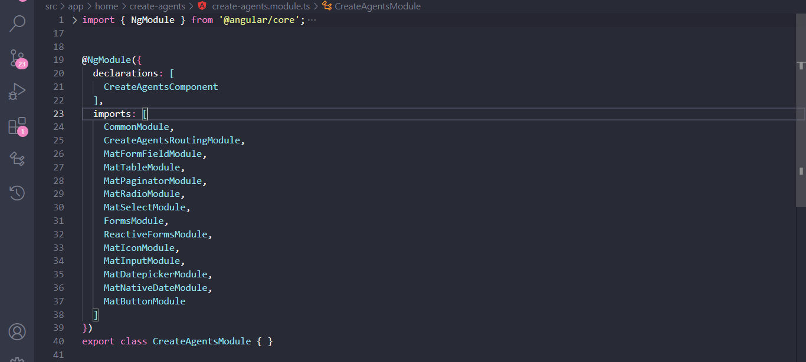
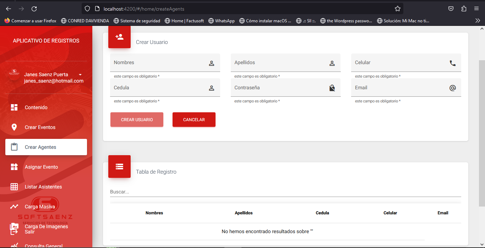
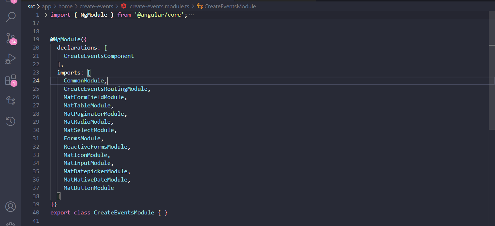
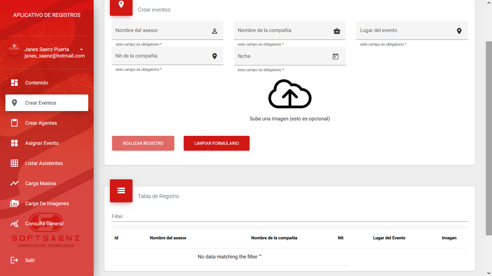
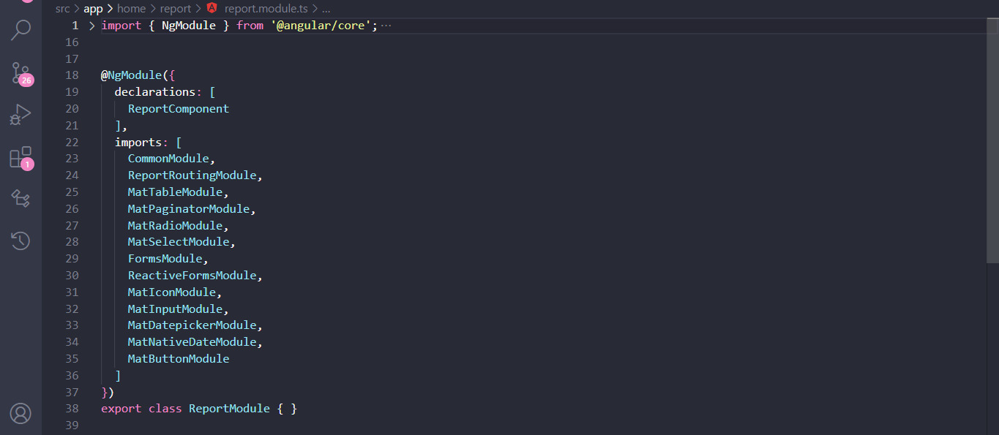
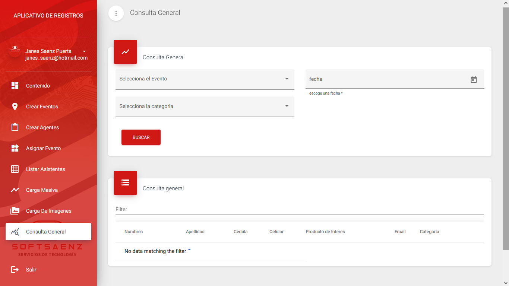
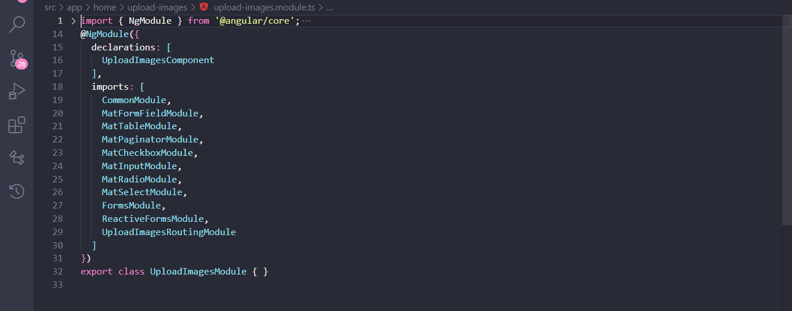

5. ## create-agents
    Este componente sera el encargado de crear agentes mediante un formulario.
    ## **create-agents.component.ts**
    variables: 
    ```ts
    displayedColumns: string[] = ['names', 'lastnames', 'cc', 'phone', 'email']; //para las columnas de la tabla
    public userList: userDataList[]=[] 
    public customerDetail: any = [];
    public form: FormGroup; 
    public dataSource: MatTableDataSource<userDataList>
    ```
    su metodo contructor se encarga de inicializar las propiedades de la clase y obtener datos necesarios para su funcionamiento a través de los servicios inyectados.

    ```ts
    constructor(
    private localStorage: LocalstoreService, //llamdo el servicio de LocalstoreServic
    private myFormBuilder: FormBuilder //instancia de FormBuilder
    ) { 
        this.customerDetail = this.localStorage.getItem(Menssage.customerDetail)
    }
    ```
    **Initial()**
    se encargara de asignar o mejor dicho de inicializar nuestro formulario (form) haciendo uso de FormGroup proveniente de Angular Reactive Forms. creara un grupo de controles del formulario, especificamente 'names', 'lastnames', 'phone', 'cc', 'password', 'email'

    ```ts
    initial(){

        //crea un formulario utilizando FormBuildergroup
        this.form = this.myFormBuilder.group({
        names: [Menssage.empty, Validators.compose([Validators.required])], //campo names con un validador requerido
        lastnames: [Menssage.empty, Validators.compose([Validators.required])],/*campo lastnames con un 
        validador requerido*/
        phone: [Menssage.empty, Validators.compose([Validators.required, Validators.maxLength(10)])], /*campo 
        names con un validador requerido adicienalmente un validador de longitud maxima en este caso 10 caracteresl*/
        cc: [Menssage.empty, Validators.compose([Validators.required])], /*campo cc con un validador requerido*/
        password: [Menssage.empty, Validators.compose([Validators.required])], /*campo password con un 
        validador requerido*/
        email: [Menssage.empty, Validators.compose([Validators.required, Validators.email])], /*campo names con 
        un validador requerido adicienalmente un validador de tipo Email*/
        })
        this.loadData()
    }
    ```
    **resetForm()**
    su fincion es limpiar el formulario
    ```ts
    resetForm(){
        this.form.reset()
    }
    ```
    **applyFilter(event: Event)**
    este metodo tiene como funcion aplicar un filtro en la tabla de datos recibe como parametro un event de tipo Event; const filterValue = (event.target as HTMLInputElement).value; obtiene el valor de filtro ingresado por el usuario; (event.target as HTMLInputElement).value; permite acceder al valor de entrada en el HTML (input). this.dataSource.filter = filterValue.trim().toLowerCase(); aplica el filtro al origen de datos (dataSource). la propiedad filter se usa para aplicar el filtro en la fuente de datos. Este es un metodo originalmente de angular Material, puede aondar mas en su documentacion oficial en [Angular Material](https://material.angular.io/components/table/examples)

    ```ts
    applyFilter(event: Event) {
        const filterValue = (event.target as HTMLInputElement).value;
        this.dataSource.filter = filterValue.trim().toLowerCase();
    }
    ```
    **loadData()** la función loadData() inicializa el origen de datos de la tabla (dataSource) con los datos proporcionados en eventList, lo que permite mostrar los datos en la tabla de forma adecuada.
    ```ts
    loadData(){
        this.dataSource = new MatTableDataSource(this.userList)
    }
    ```
    ## **create-agents-routing.module.ts**

    este módulo de enrutamiento define una única ruta para el componente CreateAgentsComponent. El path de la ruta se establece como una cadena vacía (''), lo que significa que el componente CreateAgentsComponent se cargará cuando se acceda a la ruta principal del módulo que utiliza este enrutador.
    ```ts
    import { NgModule } from '@angular/core';
    import { RouterModule, Routes } from '@angular/router';
    import { CreateAgentsComponent } from './create-agents.component';

    const routes: Routes = [{ path: '', component: CreateAgentsComponent }];

    @NgModule({
    imports: [RouterModule.forChild(routes)],
    exports: [RouterModule]
    })
    export class CreateAgentsRoutingModule { }
    ```

    ## **create-agents.module.ts**

    contiene las importaciones necesarias para el componente.
    
    ## create-agents
    

6. ## create-events
    Este componente tiene como finalida la creacion de eventos mediante un formulario ademas de permitir la carga de imagenes
    ## **create-events-component.ts**
    interfaz userDataList:
    ```ts
    export interface userDataList{
    names: string,
    lastnames: string,
    cc: string,
    phone: string,
    email: string,
    }
    ```
    variables: 
    ```ts
    displayedColumns: string[] = ['names', 'lastnames', 'cc', 'phone', 'email']; //para las columnas de la tabla
    public userList: userDataList[]=[]
    public customerDetail: any = [];
    public form: FormGroup;
    public dataSource: MatTableDataSource<userDataList>
    ```
    su metodo contructor se encarga de inicializar las propiedades de la clase y obtener datos necesarios para su funcionamiento a través de los servicios inyectados.

    ```ts
    constructor(
    private localStorage: LocalstoreService, //llamdo el servicio de LocalstoreServic
    private myFormBuilder: FormBuilder //instancia de FormBuilder
    ) { 
        this.customerDetail = this.localStorage.getItem(Menssage.customerDetail)
    }
    ```
    **ngOninit()**
    este metodo permirira visualizar el formulaio en pantalla invocando a initial()
    ```ts
        ngOnInit(): void {
        this.inital()
    }
    ```
    **initial()**
    se encargara de asignar o mejor dicho de inicializar nuestro formulario (form) haciendo uso de FormGroup proveniente de Angular Reactive Forms. creara un grupo de controles del formulario, especificamente 'assesorName', 'companyName', 'nit', 'date', 'eventPlace', 'image'
    ```ts
    inital(){
    //crea un formulario utilizando FormBuildergroup
        this.form = this.myFormBuilder.group({
        assesorName: [Menssage.empty, Validators.compose([Validators.required])], /*campo assesorName con un 
        validador de requrimiento*/
        companyName: [Menssage.empty, Validators.compose([Validators.required])],/*campo companyName con un 
        validador de requrimiento*/
        nit: [Menssage.empty, Validators.compose([Validators.required, Validators.maxLength(12)])],/*campo 
        nit con un validador de requrimiento adicionalmente un validador que solo permie una catdidad de 
        12 caracteres maximo*/
        date: [Menssage.empty, Validators.compose([Validators.required])], /*campo date con un  validador
        de requrimiento*/
        eventPlace: [Menssage.empty, Validators.compose([Validators.required])],/*campo eventpalce con un  validador
        de requrimiento*/
        image: [Menssage.empty, Validators.compose([Validators.nullValidator])] /*campo image con un  validador
        de vacio*/
        })
        this.loadData() //carga los datos de la tabla para mostarlos en pantalla
    }
    ```
    **photoSeleted()** Este metodo permitira visualizar la imagen precargada al formulario
    ```ts
    photoSelected(event: HTMLInputEvent): void{
    //para saber si estan subiendo una foto de ser asi continue
        if(event.target.files && event.target.files[0]){
        this.file = <File> event.target.files[0];
        //Ahora previzualiza la imagen
        let reader = new FileReader();
        reader.onload = e => this.photoSelection = reader.result
        reader.readAsDataURL(this.file)
        }
    }
    ```
    
    **saveData()**
    Este  metodo imprimira en pantalla todos los datos obtenidos por el formulario
    ```ts
    saveData(){
        console.log(this.form);
        this.resetForm()
    }
    ```
    **resetForm()**
    su fincion es limpiar el formulario
    ```ts
    resetForm(){
        this.form.reset()
    }
    ```
    **applyFilter(event: Event)**
    este metodo tiene como funcion aplicar un filtro en la tabla de datos recibe como parametro un event de tipo Event; const filterValue = (event.target as HTMLInputElement).value; obtiene el valor de filtro ingresado por el usuario; (event.target as HTMLInputElement).value; permite acceder al valor de entrada en el HTML (input). this.dataSource.filter = filterValue.trim().toLowerCase(); aplica el filtro al origen de datos (dataSource). la propiedad filter se usa para aplicar el filtro en la fuente de datos. Este es un metodo originalmente de angular Material, puede aondar mas en su documentacion oficial en [Angular Material](https://material.angular.io/components/table/examples)

    ```ts
    applyFilter(event: Event) {
        const filterValue = (event.target as HTMLInputElement).value;
        this.dataSource.filter = filterValue.trim().toLowerCase();
    }
    ```
    **loadData()** la función loadData() inicializa el origen de datos de la tabla (dataSource) con los datos proporcionados en eventList, lo que permite mostrar los datos en la tabla de forma adecuada.
    ```ts
    loadData(){
        this.dataSource = new MatTableDataSource(this.userList)
    }
    ```

    ## **create-events-routing.module.ts**
    este módulo de enrutamiento define una única ruta para el componente create-events. El path de la ruta se establece como una cadena vacía (''), lo que significa que el componente create-events se cargará cuando se acceda a la ruta principal del módulo que utiliza este enrutador.

    ```ts
    import { NgModule } from '@angular/core';
    import { RouterModule, Routes } from '@angular/router';
    import { CreateEventsComponent } from './create-events.component';

    const routes: Routes = [{ path: '', component: CreateEventsComponent }];

    @NgModule({
    imports: [RouterModule.forChild(routes)],
    exports: [RouterModule]
    })
    export class CreateEventsRoutingModule { }
    ```
    ## **create-events.module.ts**
    contiene las importaciones necesarias para el componente.
    
    ## create-events
    

7. ## create-guest
    ```ts
    null
    ```
8. ## dashboard
    ```ts
    null
    ```
9. ## report
    Este componente sera el encargado de consultar generalmente los registros de eventos en el aplicativo.
    ## **report.component.ts**
    Interfaz userDataList:
    ``` ts
    export interface userDataList{
    id: string,
    names: string,
    lastnames: string,
    cc: string,
    email: string,
    phone: string,
    category: string
    }
    ```
    variables: 
    ```ts
    public customerDetail: any = [];
    public selectItems: any;
    public eventsItems: any = [];
    public usersData: any;
    public userCategory: any = [];
    public form: FormGroup;
    public dataSource: MatTableDataSource<userDataList>
    displayedColumns: string[] = ['names', 'lastnames', 'cc', 'phone', 'productInterest','email', 'category'];
    public eventList: userDataList[] = []
    ```
    su metodo contructor se encarga de inicializar las propiedades de la clase y obtener datos necesarios para su funcionamiento a través de los servicios inyectados.
    ```ts
    constructor(
    private localStorage: LocalstoreService, //llamdo el servicio de LocalstoreServic
    private myFormBuilder: FormBuilder //instancia de FormBuilder
    private _https: AuthService, //inyecya el servicio AuthService
    private alert: AlertService, //inyecya el servicio AlertService
    ) { 
        this.customerDetail = this.localStorage.getItem(Menssage.customerDetail)
    }
    ```
    **ngOninit()**
    este metodo permirira visualizar el formulaio en pantalla invocando a initial()
    ```ts
        ngOnInit(): void {
        this.inital()
    }
    ```
    **initial()**
    se encargara de asignar o mejor dicho de inicializar nuestro formulario (form) haciendo uso de FormGroup proveniente de Angular Reactive Forms. creara un grupo de controles del formulario, especificamente 'category', 'events', 'date'.

    ```ts 
    initial(){
        this.form = this.myFormBuilder.group({
        category: [Menssage.empty, Validators.compose([Validators.required])],/*campo category con un validador de 
        requrimiento*/
        events: [Menssage.empty, Validators.compose([Validators.required])], /*campo events con un validador de 
        requrimiento*/
        date: [Menssage.empty, Validators.compose([Validators.required])], /*campo date con un validador de 
        requrimiento*/
        })
        this.loadData()//carga los datos de la tabla para mostarlos en pantalla
    }
    ```
    **getEvents()**
    este metodo serra el encargado de traer los eventos que tenga el aplicativo, mediante .https accedera al servicio (AuthService) especificamente a su metodo getEvent(), el cual hara un solicitud API para obtener la informacion, maneja respuestas exitosas y tambie errores.
    ```ts
    getEvents(item: number) {
        this.alert.loading();
        //llama al metodo getEvent() proporcionado por AuthService mediante _https
        this._https.getEvent(item).then((resulta: any) => {
            console.log(resulta);
            //asigna el valor de la llamada al arreglo eventsItems
            this.eventsItems = resulta

            //muestra un mensaje usando el servicio de alert
            this.alert.messagefin();

            //en caso de error mostrara un mensaje de error
        }).catch((err: any) => {
            console.log(err)
            this.alert.error(Menssage.error, Menssage.server);
        });
    }
    ```
    **getCategories()** Este metodo trata de traer las categorias que tenga el aplicativo mediante .https accedera al servicio (AuthService) especificamente a su metodo getCategory(), el cual hara un solicitud API para obtener la informacion, maneja respuestas exitosas y tambie errores.
    
    ```ts 
        getCategories(){
        //mensaje de carga 
        this.alert.loading();
        this._https.getCategory().then((resulta:any)=>{
        //imprime los valores obteidos en consola
        console.log(resulta);
        //asiga el resultado a userCategory
        this.userCategory=resulta
        //muestra un mensaje de finalizacion
        this.alert.messagefin();
        //mensaje de error en caso de errores
        }).catch((err: any) => {
        console.log(err)
        this.alert.error(Menssage.error, Menssage.server);
        });
    }
    ```
    **loadData()** la función loadData() inicializa el origen de datos de la tabla (dataSource) con los datos proporcionados en eventList, lo que permite mostrar los datos en la tabla de forma adecuada.
    ```ts
    loadData(){
        this.dataSource = new MatTableDataSource(this.userList)
    }
    ```
    **applyFilter(event: Event)**
    este metodo tiene como funcion aplicar un filtro en la tabla de datos recibe como parametro un event de tipo Event; const filterValue = (event.target as HTMLInputElement).value; obtiene el valor de filtro ingresado por el usuario; (event.target as HTMLInputElement).value; permite acceder al valor de entrada en el HTML (input). this.dataSource.filter = filterValue.trim().toLowerCase(); aplica el filtro al origen de datos (dataSource). la propiedad filter se usa para aplicar el filtro en la fuente de datos. Este es un metodo originalmente de angular Material, puede aondar mas en su documentacion oficial en [Angular Material](https://material.angular.io/components/table/examples)

    ```ts
    applyFilter(event: Event) {
        const filterValue = (event.target as HTMLInputElement).value;
        this.dataSource.filter = filterValue.trim().toLowerCase();
    }
    ```

    ## **report-routing.module.ts**
    este módulo de enrutamiento define una única ruta para el componente report. El path de la ruta se establece como una cadena vacía (''), lo que significa que el componente report se cargará cuando se acceda a la ruta principal del módulo que utiliza este enrutador.
    ```ts
    import { NgModule } from '@angular/core';
    import { RouterModule, Routes } from '@angular/router';
    import { ReportComponent } from './report.component';

    const routes: Routes = [{ path: '', component: ReportComponent }];

    @NgModule({
    imports: [RouterModule.forChild(routes)],
    exports: [RouterModule]
    })
    export class ReportRoutingModule { }
    ```

    ## **report.module.ts**
    contiene las importaciones necesarias para el componente.
    
    ## report
    
10. ## upload-images   
    Este componente tiene como funcion principal la caga de imagenes segun el evento correspondiente.
    ## **upload-images.component.ts**
    interfaz:
    ```ts
    export interface UserData {
    id: number,
    idEvents: number,
    nameEvent: string,
    companyNameEvent: string,
    nitEvent: string,
    dateEvent: string,
    imgEvent: string,
    }
    ```
    variables: 
    ```ts
    public usersData: any;
    public eventList: any = [];
    public calendarVisible = false;
    public eventsData: any=[];
    public customerDetail: any = [];
    public images:any = [];
    public eventItems: any = [];
    public selectItems: any;
    private needRefresh = false;
    public displayedColumns: string[] = ['id',  'company', 'nameUser', 'img', 'accion' ];
    public dataSource: MatTableDataSource<UserData>;
    ```

    En su metodo constructor: 
    ```ts
    constructor(
        private localStore: LocalstoreService, //llamdo el servicio de LocalstoreService
        private _https: AuthService, //inyectando el servicio de AuthService
        private alert: AlertService) //inyecya el servicio AlertService
        { 
        this.usersData = this.localStore.getSuccessLogin();
        this.customerDetail = this.localStore.getItem(Menssage.customerDetail)
        this.getEvents(this.usersData.user.idClientsProjects);
        this.getEventImg(this.usersData.user.idClientsProjects, '')
    }
    ```
    **getEvents()**
    este metodo serra el encargado de traer los eventos que tenga el aplicativo, mediante .https accedera al servicio (AuthService) especificamente a su metodo getEvent(), el cual hara un solicitud API para obtener la informacion, maneja respuestas exitosas y tambie errores.
    ```ts
    getEvents(item: number) {
        this.alert.loading();
        //llama al metodo getEvent() proporcionado por AuthService mediante _https
        this._https.getEvent(item).then((resulta: any) => {
            console.log(resulta);
            //asigna el valor de la llamada al arreglo eventsItems
            this.eventsItems = resulta

            //muestra un mensaje usando el servicio de alert
            this.alert.messagefin();

            //en caso de error mostrara un mensaje de error
        }).catch((err: any) => {
            console.log(err)
            this.alert.error(Menssage.error, Menssage.server);
        });
    }
    ```
    **getFileDetails()**
    Este metodo funciona recibiendo un parametro (event) que sera de tipo any, su funcion es la carga de imagenes al aplicativo, haciendo validaciones
    ```ts
    getFileDetails(event: any){

        //verifica que haya un elemento seleccionado en selectItems
        if (this.selectItems) {

        //de ser asi obtendra el archivo seleccionado 
        let file = event.target.files[0];
            var reader = new FileReader();
            reader.readAsDataURL(file); //lee el contenido del archivo como una URL de datos
            reader.onload = function () {
            file.dataURL = reader.result // Guardar la URL de datos del archivo en la propiedad "dataURL" del archivo
            };
            console.log(this.selectItems) //mostrara en consola el valor de selectItems

            //Agrega una imagen al array de (images) con los detalles del archivo y sus propiedades
            this.images.push({
            img: file, 
            idEvent: this.selectItems, 
            idUsers: this.usersData.user.id, 
            idClientsProjects: this.usersData.user.idClientsProjects 
            })

            //imprimira en consola en nuevo valor de images
            console.log(this.images)

            //en caso de error mostrar un mensaje en la interfaz de usuario
        } else {
        this.alert.error(Menssage.error, Menssage.idEvents);
        }
    }
    ```
    **deleteList()** 
    Su funcion es eliminar los registros que se encuentran en la tabla de datos, recibiendo como parametro un ID
    ```ts
    deleteList(id:number){
        //muestra un mensaje de carga
        this.alert.loading();
        //accede al servicio AuthService mediante _https llamando a deleteRegisterImageEvent quien eliminara el registro
        this._https.deleteRegisterImageEvent(id).then((resulta: any)=>{
        
        //mensaje de exito en la eliminacion del registro
        this.alert.success(Menssage.exito, Menssage.successDelete);

        //actualiza la lista de imagenes
        this.getEventImg(this.usersData.user.idClientsProjects, '')

        //en caso de que la peticion sea rechazada o haya fallado enviara un error 
        }).catch((err: any)=>{
        console.log(err)
        this.alert.error(Menssage.error, Menssage.server);
        });
    }
    ```
    **resgisterImageEvents** 
    Esta funcion se encarga de  registrar  las imagenes del evente
    ```ts
    resgisterImageEvents(){

        //verifica que existan imagenes por registrar
        if (this.images.length != 0) {

        //mostrara un mensaje de carga
        this.alert.loading();

        //crea un ibjeto con los datos nesesarios para el registro de la imagen
        const data = {
            img: this.images,
            idEvent: this.selectItems, 
            idUsers: this.usersData.user.id, 
            idClientsProjects: this.usersData.user.idClientsProjects 
        }

        //llama al metodo resgisterImageEvents de AuthService enviando como parametro (data)
        this._https.resgisterImageEvents(data).then((resulta: any)=>{

            //Cuando el registro fue exitoso
            this.alert.success(Menssage.exito, Menssage.successDelete);

            //Actualiza la lista de imagenes
            this.getEventImg(this.usersData.user.idClientsProjects, '')

            //limpia el array de images
            this.images = []

        //en caso de error arrojara un mensaje
        }).catch((err: any)=>{
            console.log(err)
            this.alert.error(Menssage.error, Menssage.server);
        });

        //en caso de que no hayan seleccionado una imagen
        } else {
        this.alert.error(Menssage.error, Menssage.idImg);
        }
        
    }
    ```

    **getEventImg()**
    Este metodo se encarga de obtener las imagenes que se encuentarn registradas en del evento
    ```ts
    getEventImg(item: number, itenEvents:string){

        //llama al metodo getEventImg del servicio AuthService mediante _https
        this._https.getEventImg(item, itenEvents).then((resulta: any)=>{

            //muestra el valor que reciba (resulta)
            console.log(resulta); 
            let count = 1;
            this.eventsData = [] //inicializa eventsData como un array vacio
            resulta.forEach(element => {

                //crea un objeto para posteriormente añadirlo a eventsData
                this.eventsData.push({
                    id: count++,
                    idEvents:element.id,
                    nameEvent: element.nameEvent,
                    companyNameEvent: element.companyNameEvent,
                    nitEvent: element.nitEvent,
                    dateEvent: element.dateEvent,
                    imgEvent: element.imgEvent
                },);
            });
            //Para reflejar los resultados en una tabla añadiendo tambien un paginador
            this.dataSource = new MatTableDataSource(this.eventsData);
            this.dataSource.paginator = this.paginator;
            this.dataSource.sort = this.sort;

         // en caso de  error
        }).catch((err: any)=>{
            console.log(err)
            this.alert.error(Menssage.error, Menssage.server);
        });
    }
    ```
    **applyFilter(event: Event)**
    Aplica un filtro a la tabla de datos añadiendo tambien un paginador
    ```ts
    applyFilter(event: Event) {
        //aplica el filtro segun el valor de entrada recibido en el html
        const filterValue = (event.target as HTMLInputElement).value;
        this.dataSource.filter = filterValue.trim().toLowerCase();
        //paginador
        if (this.dataSource.paginator) {
        this.dataSource.paginator.firstPage();
        }
    }
    ```

    ## **upload-images-routing.module.ts**
    En este caso, los comentarios describen el propósito y la funcionalidad general del código. El archivo define un módulo de enrutamiento (UploadImagesRoutingModule) que importa el módulo RouterModule y configura una única ruta. La ruta está asociada a una ruta vacía ('') y carga el componente UploadImagesComponent.

    ```ts
    import { NgModule } from '@angular/core';
    import { RouterModule, Routes } from '@angular/router';
    import { UploadImagesComponent } from './upload-images.component';

    const routes: Routes = [{ path: '', component: UploadImagesComponent }];

    @NgModule({
    imports: [RouterModule.forChild(routes)],
    exports: [RouterModule]
    })
    export class UploadImagesRoutingModule { }
    ```

    ## **upload-images.module.ts**
    contiene las importaciones necesarias para el componente.
    

    


